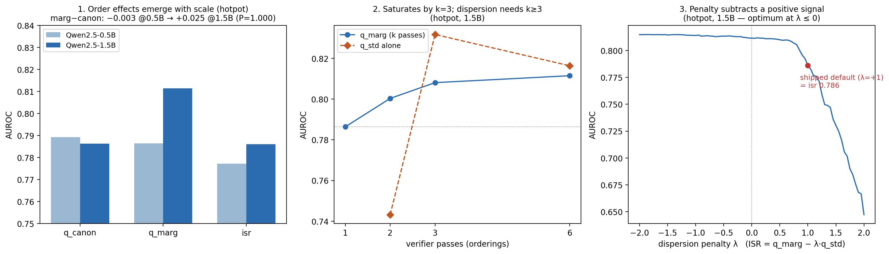

# Order sensitivity in ntkmirror's ISR verifier: a small calibration study

ntkmirror's new hallucination detector ([`isr-auc`](https://github.com/leochlon/ntkmirror)) scores whether a claim is supported by its evidence. It reports a single-pass score (`q_canon`), an order-marginalized score over k random evidence orderings (`q_marg`), and an ISR score that penalizes claims whose support probability is unstable under reordering (`isr = q_marg − λ·std`, shipped λ = 1).

I ran the verifier on Qwen2.5-0.5B and 1.5B (Instruct) across vitaminc, hotpot, and ragtruth, 200 rows per run, on a free Colab T4. Total GPU time was under an hour. Five things came out of it, and one of them surprised me: at these scales, the dispersion penalty subtracts a signal that is positively correlated with support. The instability the penalty punishes is carried mostly by *supported* claims.



## Setup

All runs use the stock CLI, e.g.:

```bash
ntkmirror isr-auc --model Qwen/Qwen2.5-1.5B-Instruct --dataset hotpot --n 200 --num-orderings 6 --out runs/isr_hotpot_1p5b.json
```

Defaults otherwise. One ordering seed. Per-claim analysis (bootstrap, λ sweep, dispersion-only scores) is computed offline from the per-row outputs in the result JSONs.

## Results

AUROC on 200 rows per run:

| model | dataset | k | q_canon | q_marg | isr |
|---|---|---|---|---|---|
| 0.5B | vitaminc | 6 | 0.6315 | 0.6386 | 0.6211 |
| 0.5B | hotpot | 6 | 0.7892 | 0.7865 | 0.7773 |
| 1.5B | hotpot | 2 | — | 0.8003 | — |
| 1.5B | hotpot | 3 | 0.7864 | 0.8081 | 0.7815 |
| 1.5B | hotpot | 6 | 0.7864 | 0.8115 | 0.7861 |
| 1.5B | ragtruth | 6 | 0.5688 | 0.5689 | 0.5594 |

(`q_canon` is deterministic for a given model and dataset, so it repeats across k. Vitaminc turned out to be the wrong instrument for order questions: 155 of 200 rows have a single evidence span, so there is nothing to reorder. It stays in the table for completeness.)

### 1. Order sensitivity emerges between 0.5B and 1.5B

On hotpot (199/200 rows have 4–5 spans, so reordering is always possible):

| | 0.5B | 1.5B |
|---|---|---|
| mean per-claim std of P(YES) over orderings | 0.0034 | 0.0196 |
| max | 0.0458 | 0.1956 |
| claims with std > 0.05 | 0% | 13% |
| verdict flips (canon vs marg across 0.5) | 0/200 | 2/200 |
| q_marg − q_canon | −0.003 | +0.025 |

At 0.5B the verifier doesn't care what order it reads evidence in, and marginalization buys nothing. At 1.5B the sensitivity is real and marginalization pays: paired bootstrap on the 1.5B gap gives +0.0253, 95% CI [+0.0105, +0.0421], P(gap > 0) = 1.000 over 2,000 resamples.

### 2. Marginalization saturates by k = 3

The passes-vs-AUROC frontier on hotpot at 1.5B:

| verifier passes | AUROC |
|---|---|
| 1 (canonical) | 0.7864 |
| 2 | 0.8003 |
| 3 | 0.8081 |
| 6 | 0.8115 |

The second pass captures about half the full gain. The third gets you to ~85%. Passes four through six combined add 0.003. If you want the marginalization benefit, k = 3 is the efficient point; k = 6 mostly buys decimal places.

### 3. The dispersion penalty has the wrong sign at these scales

This is the one I didn't expect. The correlation between a claim's order-dispersion (q_std) and its gold label is *positive* on both multi-span datasets: +0.42 on hotpot (1.5B), +0.18 on ragtruth (1.5B). Supported claims wobble more under reordering, not less.

The shipped ISR score subtracts dispersion, so it subtracts evidence. It is the worst of the three scores on every run in the table above. Sweeping the penalty λ on the hotpot 1.5B rows: λ = +1.0 gives 0.7861, which matches the shipped `isr` output to four decimals (confirming the default), while λ = 0 gives 0.8115 and the in-sample optimum sits at negative λ (~0.815). I'd trust the sign of that sweep, not the magnitude — the optimum is fit on the same 200 rows it's evaluated on.

### 4. Dispersion alone is a competitive score, if k ≥ 3

Since dispersion correlates with support, I scored claims by q_std alone:

| | hotpot 1.5B | ragtruth 1.5B |
|---|---|---|
| q_std alone, k=6 | 0.8164 | 0.5928 |
| q_std alone, k=3 | 0.8317 | — |
| q_std alone, k=2 | 0.7432 | — |
| best probability score | 0.8115 (marg, k=6) | 0.5689 (marg) |

On hotpot, dispersion alone beats every probability-based score, and the k=6 advantage over q_canon survives a paired bootstrap (+0.0303, 95% CI [+0.0057, +0.0545], P = 0.992). The k=3 number (0.8317) is the best AUROC anywhere in this study, though a std estimated from three samples is noisy and I wouldn't lean on the exact value. At k=2 it collapses, as you'd expect from a two-sample standard deviation. On ragtruth the dispersion score is directionally best but the margin (+0.024 over canon) is within noise at n=200.

### 5. The verifier is near chance on real RAG hallucinations at 1.5B

Ragtruth is the dataset closest to the product use case: real RAG outputs, real hallucinations. Every score lands near 0.56–0.59 there, and marginalization buys +0.0001. The ~0.8 hotpot numbers come from a cleaner task (gold vs distractor evidence). Whatever scoring scheme you pick, 1.5B doesn't look big enough for the real thing, which is consistent with the repo's own KV-debias examples targeting 7B.

## A hypothesis (not a result)

Why would supported claims wobble more? My guess: a supported claim has a gold span whose position in the context matters. Attention and recency effects move P(YES) depending on where that span sits, so reordering moves the score. For an unsupported claim, no ordering makes the evidence support it, so the score stays flat and low. Under this reading, dispersion is detecting "there exists evidence whose placement matters," which is a proxy for "relevant evidence exists." It also fits the correlation dropping from +0.42 (hotpot, clean distractors) to +0.18 (ragtruth, subtler hallucinations). I haven't tested this directly; one way would be to correlate per-claim q_std with the variance of the gold span's position across orderings.

## What I'd suggest for the feature

- Default `--num-orderings` to 3 above ~1B. Below ~1B, skip marginalization; the canonical score is as good and 6× cheaper.
- Make the dispersion penalty configurable and calibrate it per deployment rather than shipping λ = 1. At 1.5B on both datasets the useful direction is λ ≤ 0. Promoting q_std from the per-row output to a first-class summary score seems worth considering, with the k ≥ 3 floor noted.
- Don't rely on the verifier gate alone for real RAG outputs below ~7B.

## Caveats

n = 200 per run, one model family, one ordering seed. The λ sweep is in-sample. Hotpot's negatives are constructed from distractor evidence, which could manufacture part of the dispersion signal by design; ragtruth agreeing on the sign is reassuring but its q_std edge is not significant on its own. Two model sizes make a contrast, not a scaling law — 7B is untested here. Subgroup AUROCs conditioned on q_std are confounded (q_std correlates with the label), so I report only pooled numbers.

## Reproducing

Each table row is one CLI call of the form shown in Setup, swapping `--model`, `--dataset`, and `--num-orderings`. The offline analysis reads the per-row `q_canon`, `q_marg`, `q_std`, `supported` fields from the output JSONs in this repo. `make_figure.py` regenerates the figure from those JSONs. Everything ran on a free Colab T4.
